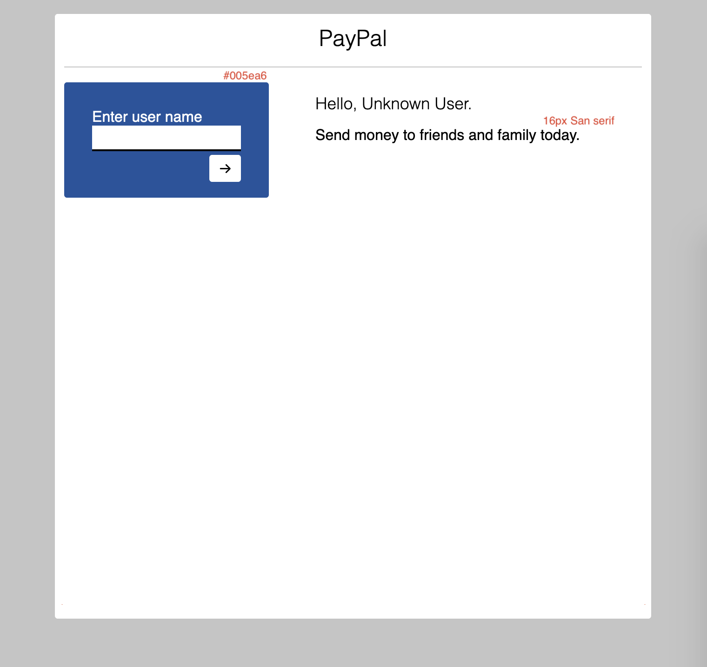

This project was bootstrapped with [Create React App](https://github.com/facebookincubator/create-react-app).

# Instructions
Start the App

Make edits to the code so that:

## Functionality 
When user submits a "user name", the marketing.js component should update with the name supplied in login.js

## Markup
Ensure that semantic markup should be used to describe all content.

## Accessibility 
All content should be comprehensible by a screen reader user.

## Style
Style the page to match mockup.png as closely as possible.

